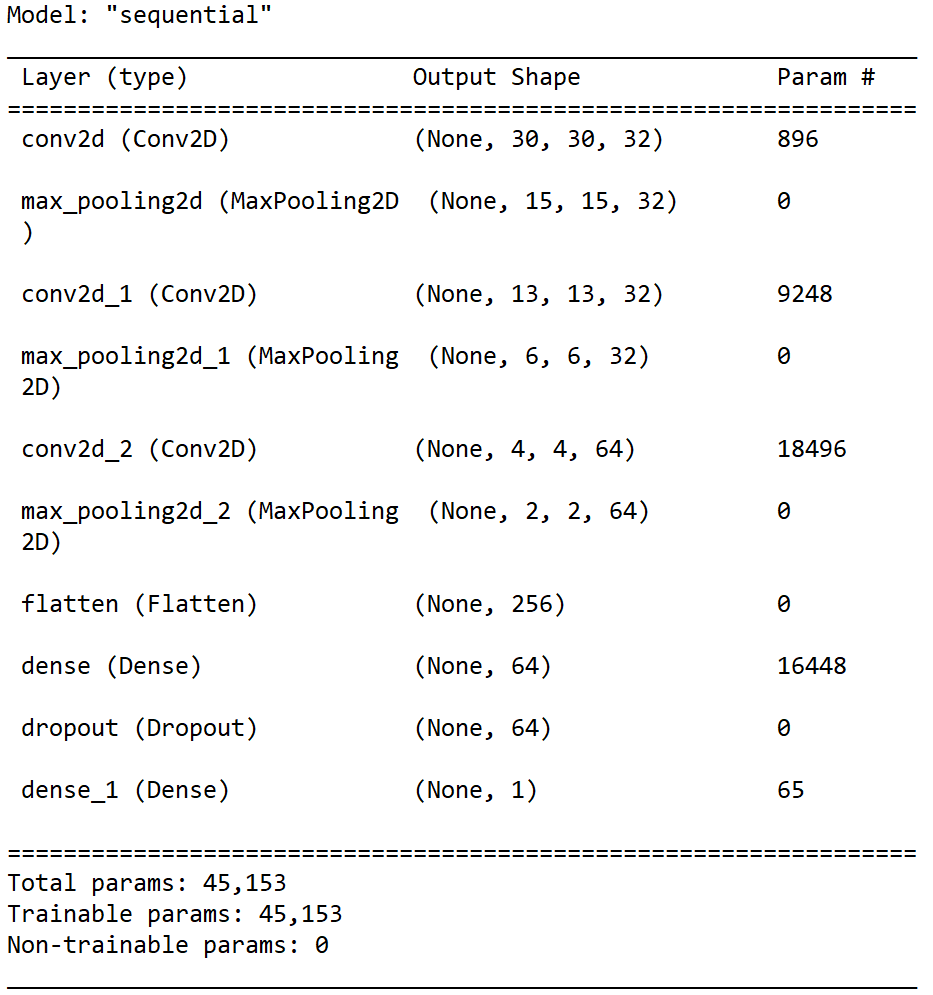

# Архитектура модели:
****

## Описание:
- Тип модели - <code>Sequential</code>
- Модель состоит из <code>10 слоев</code> , из которых: 
  - <code>3</code> **слоя свертки** <code>Conv2D</code> (**размер ядра** <code>3x3</code>, **размер карты признаков** <code>32</code> (в последнем - <code>64</code>), **функция активации** - <code>ReLu</code>)
  - <code>3</code> **слоя подвыборки** <code>MaxPooling2D</code> (**выбор макс. значения из квадрата** - <code>2x2</code> , **функция активации** - <code>ReLu</code>)
  - Слой <code>Flatten</code> **для преобразования из двумерного представления в одномерное**
  - **Полносвязный слой** <code>Dense</code> (**кол-во нейронов** - <code>64</code>, **функция активации** - <code>ReLu</code>)
  - **Слой** <code>Dropout</code> (**параметр** <code>rate= 0.5</code>)
  - **Выходной слой** <code>Dense</code> (<code>1</code> нейрон, **функция активации** - <code>Sigmoid</code>)
- <b><code><a href='src/create_model.py'>Путь до файла с исходным кодом модели</a></code></b>

## Вызов функции <code>model.summary()</code>:

